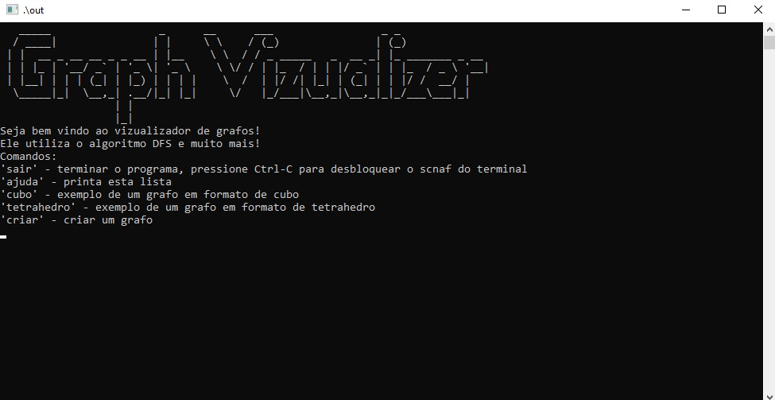
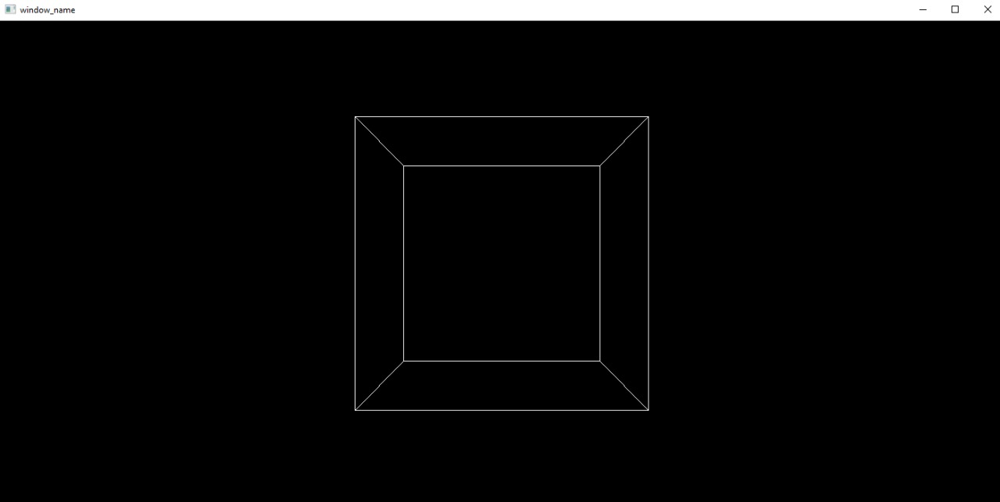
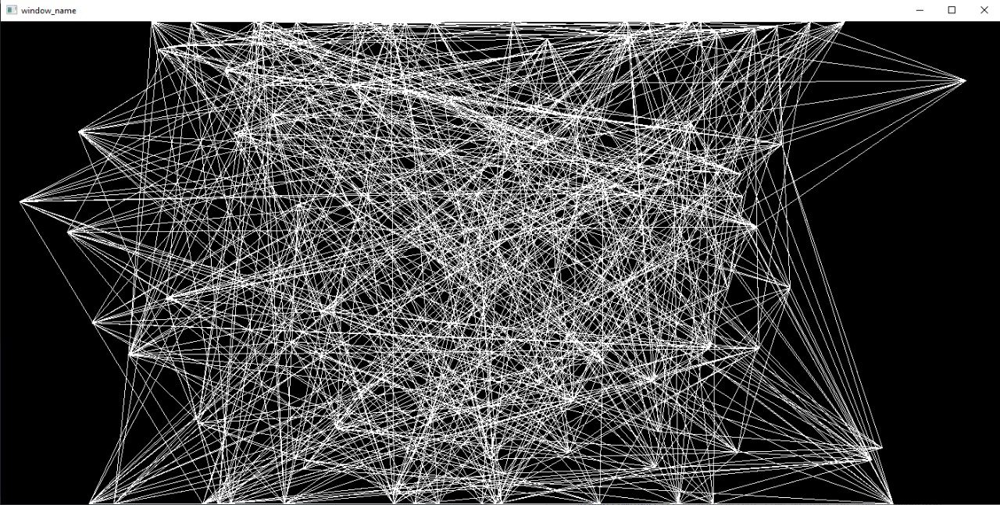
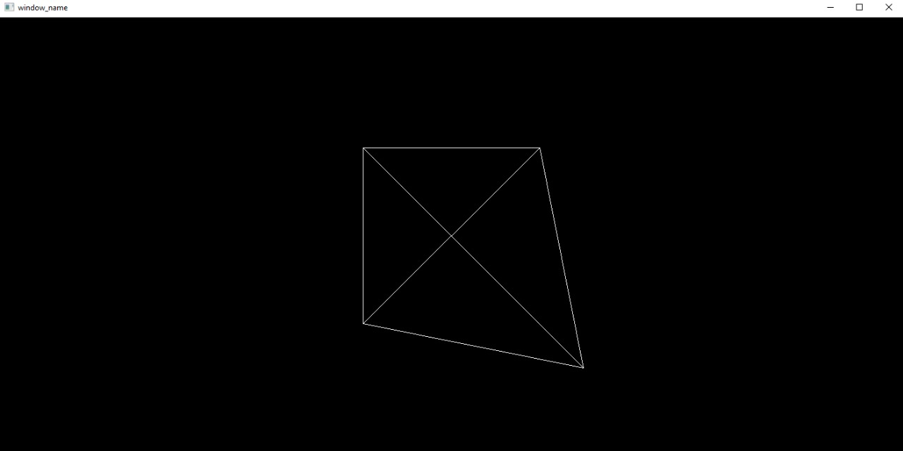

# Visualizador de Grafos

**Número da Lista**: 12<br>
**Conteúdo da Disciplina**: Grafos 1<br>

## Alunos
| Matrícula  | Aluno                                    |
| ---------- | ---------------------------------------- |
| 19/0118059 | Vinicius Angelo de Brito Vieira          |
| 18/0126130 | Luciano Alves do Brasil Schindel Machado |

## Sobre 
O projeto consiste em um visualizador de grafos, onde o usuário pode criar um desenho gráfico no terminal, utilizando o algoritmo de DFS para a criação do grafo. O programa é capaz de criar um grafo com a quantidade desejada de vértices e coordenadas, e então o programa irá desenhar o grafo na tela.

## Screenshots

 
 
 


## Instalação 
**Linguagem**: C<br>
Para instalar o programa, é necessário o compilador GCC instalado, e a utilização do sistema operacional windows, basta clonar o repositório e executar o arquivo executável. Para isso, execute os seguintes comandos no terminal:
```bash
$ git clone https://github.com/viniciusvieira00/Grafos1_Visualizador-de-Grafos.git
```

## Uso 
Para a utilização do programa, basta executar o arquivo executável e seguir as instruções na tela, para executar o programa, execute o seguinte passo a passo na pasta que acaba de clonar o projeto:
```bash
$ cd Grafos1_Visualizador-de-Grafos/src
$ ./run.bat
```

## Outros 
É necessário ter o compilador GCC instalado para a execução do programa, e que seja compatível com a biblioteca pthreads, para isso recomendamos a utilização do compilador GNU GCC. <br>
Link para download: https://gcc.gnu.org/install/index.html


